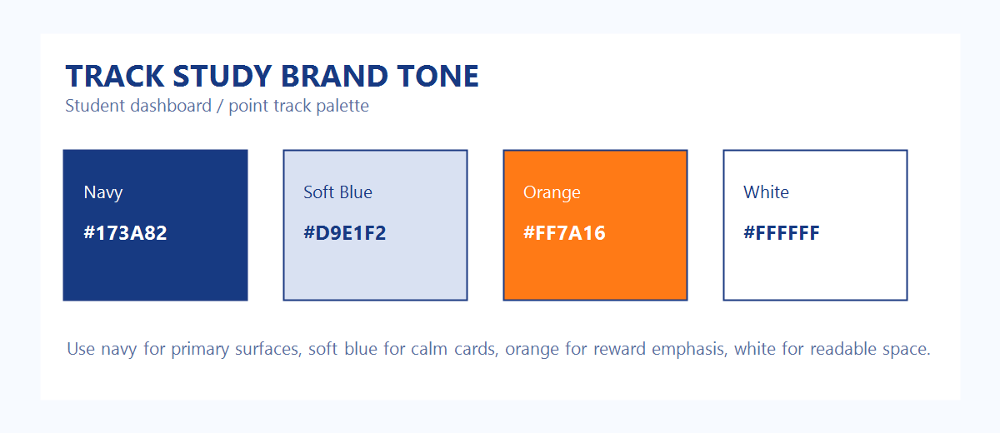

# Track Study Brand Tone

학생 대시보드와 포인트트랙은 아래 브랜드 톤을 기본 기준으로 사용한다.

## Core Palette

- `#173A82` : 메인 네이비. 기본 배경, 핵심 숫자, 타이틀, 중요한 인터랙션의 뼈대 색상
- `#D9E1F2` : 소프트 블루. 카드 배경, 보조 패널, 테두리, calm surface
- `#FF7A16` : 브랜드 오렌지. 보상 강조, CTA, 현재 상태, 랭킹/포인트 포인트 컬러
- `#FFFFFF` : 화이트. 텍스트 대비, 여백, 카드 내부 안정감

## Dashboard Rules

- 학생 대시보드 핵심 카드: `화이트/소프트 블루` 바탕 + `네이비` 텍스트
- 포인트/보상/CTA: `오렌지`를 한 번에 하나의 포인트로만 사용
- 다크 배경 위 텍스트: `화이트`, `화이트/70`, `화이트/55`, `화이트/35` 체계로 통일
- 차트나 sparkline의 포인트 노드: `오렌지`
- 랭킹/배지/버튼의 primary fill: `네이비`, highlight only `오렌지`

## Quick Tone Check

- 화면이 너무 차갑다면: `#D9E1F2` 비중을 올린다
- 화면이 너무 무겁다면: `화이트` 패널을 추가한다
- 보상이 안 튄다면: `#FF7A16` glow, pill, 숫자 강조를 더한다
- 정보가 산만하다면: 네이비와 오렌지 외의 강조색을 줄인다
